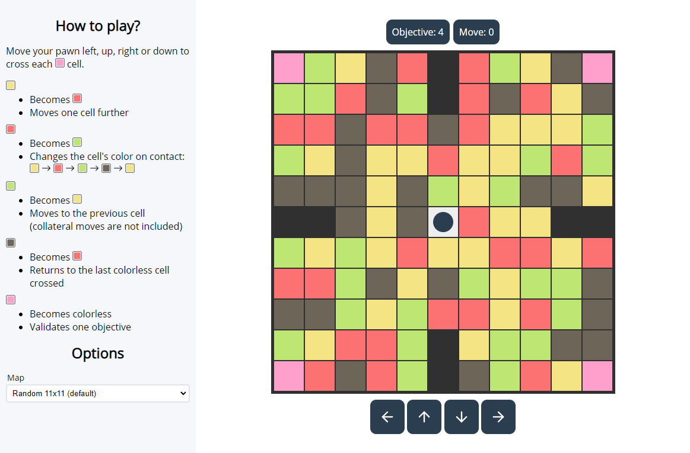

# Rainikrone

Reproduction of the Rainikrone mini-game from Dofus in Javascript.

## How to play

The goal is to move the pawn to cross all the "objective" (pink) cells. But each type of cell has a particular effect:

- **Yellow** cells: Becomes _red_ and move one cell further.
- **Red** cells: Becomes _green_ and changes the cell's color on contact: _yellow_ -> _red_ -> _green_ -> _black_ -> _yellow_.
- **Green** cells: Becomes _yellow_ and move to the previous cell.
- **Black** cells: Becomes _red_ and moves to the last colorless cell crossed.
- **Pink** cells: Becomes colorless validates an objective.



## Deploy

Deploy using Docker:

```bash
docker run -p 3000:80 skkay/rainikrone
```

Or a Docker Compose:

```yml
version: '3'

services:
  app:
    image: skkay/rainikrone
    ports:
      - 3000:80
```

## Development

This project requires [Node.js](https://nodejs.org/) and [Yarn](https://yarnpkg.com/) to be installed.

1. Clone the repository:

```bash
git clone https://github.com/Skkay/Rainikrone
cd Rainikrone
```

2. Install dependencies:

```bash
yarn install
```

3. Start the development server:

```bash
yarn run dev
```

## Build for production

Using Docker:

```bash
docker compose build
```

Or using Yarn:

```bash
yarn run build
```
