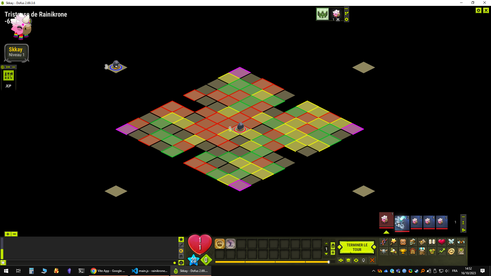

# Dofus Map to JSON

Converts a Dofus map screenshot to a JSON file.

## Usage

Place your Dofus map screenshot in `./tools/dofus-map-to-json/input.png`.

From the root of the project, run the following command (the output file will be saved to `./tools/dofus-map-to-json/output.json`):

```bash
node tools/dofus-map-to-json/main.js
```

## Note

This script is adapted to read a PNG file with a size of 1920x1080 pixels, Dofus running in windowed mode on Windows 10 with the default UI scale (100%), anc in creature mode.

## Example

Rename `./tools/dofus-map-to-json/example-input.png` to `./tools/dofus-map-to-json/input.png`.

```bash
node tools/dofus-map-to-json/main.js
```



The ouput file shoule be the same as `./tools/dofus-map-to-json/example-output.json`.
